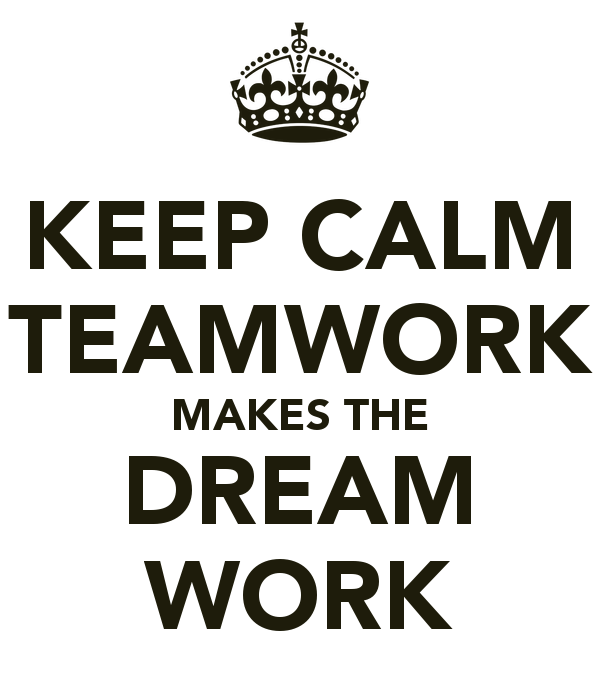

  

Configuration management is a necessary skill to have when building and maintaining complex software systems. 
Proper configuration management allows teams to oversee development, and maintain consistency and performance 
of a product. Without proper management, a team may experience troubles working together, configuration management 
helps with this problem.From my experiences with working in groups, keeping everyone up to date with the project's status is one of the most important aspects of teamwork. If everyone is not immediately updated, or updated simutaneously, about an important change, ideas and work tend to get lost and time can potentially be wasted. 

For example, in my previous ICS class, ICS 426, we were split into groups for the entirety
of the whole semester; the thing that made it more difficult was that it was an online class. In order for everyone to keep up to date we used google docs to store all of our assignments we were currently working on. Our communications were through email and comments left in the docs, which both proved to be very useful. Whenever an update was made, we could rely on google docs to keep a log of who made the changes, when they were made, and where they were made. If the update was important enough, an email would be sent out to each group member in the hopes of getting immediate feedback.

  

