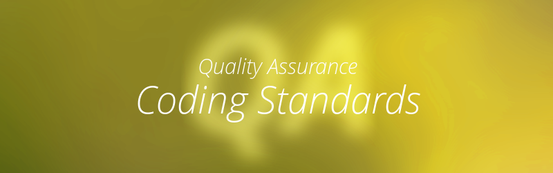

  

Coding Standards can be some of the most basic aspects of coding as well as the most important. When I first started coding,
my professor and TA would always stress the importance of properly indenting your code and commenting it.
I would be lying if I said coding standards have not helped me learn and grow comfortable with my own coding today.
Not only does it help me understand what I write in the moment, it also helps me understand programs I have
written in the past.

A few years ago, I had a friend who came to me for help with his code. Wanting to be of assistance I decided
to look and see what I could do. Once I saw his program I could immediately tell that he didn't 
pay much attention to tabs. Functions weren't properly spaced or properly indented and I found it a bit of a challenge. 
Regardless, I was able to tough out my own problems and help pinpoint his. Although I prefer to stick to coding standards, 
I also believe that whatever coding style a person is comfortable with, they should be able to do for their own sake of 
learning. However, in a professional setting, being able to understand your teammates code and them being able to understand 
yours is very important. So, in a professional setting, I would say coding standards should be required. 

  

The first IDE I was introduced to was jGrasp. For a beginner, jGrasp is perfect. It's simplicity for producing quality
code made a perfect environment for me while learning Java. I later found out that jGrasp wasn't the only IDE, and that
it was far from being the best. Other IDEs such as NetBeans or Eclipse came up and I gave them a try. I found that 
being comfortable with different IDEs is very useful since they all offer their own unique style and set of utilities.
After being introduced to ESLint and Intellij, my thought of knowing how to work around multiple IDEs has been reinforced.
The infamous green checkmark of Intellij can be a pain to achieve but once it is, you can rest assured knowing that 
you're doing something right.

ESLint and Intellij won't be the last of the IDEs I will cross paths with. More will pop up and I will rise to
the challenge of understanding as much as I can. In the ever-changing future of technology there will always 
be new topics, problems, and challenges but until they appear, I will remain ready to tackle them.
