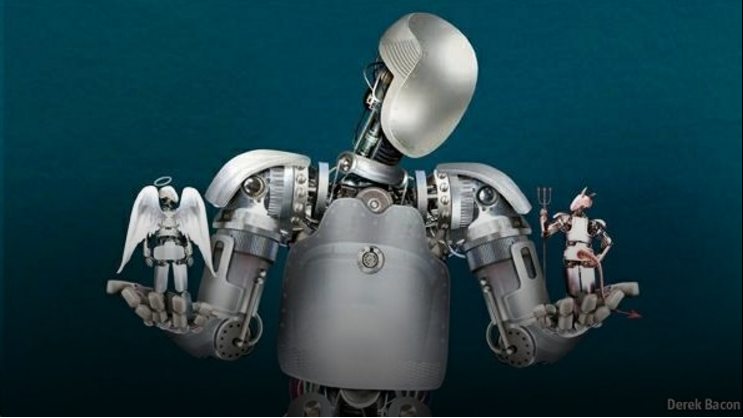

  

## Ethical decisions in Autonomous cars

How do you program an AI to be ethical? Some view AI and ethics as a bottle of water and oil, the two will never mix, even if you shake the bottle it may seem that the two liquids come close to mixing, but they wil always be two different substances. The thought of an ethical AI is not something most people can see. To be ethical is to be able to know right from wrong, to have a sense of morality. How does a robotic lawyer sound? Could a robotic lawyer ever be able to perform with the morality of a human? Having an AI determining your fate in court is not something most people would agree to. It's situations such as these that even make myself feel uncomfortable. This issue can be brought to the streets as well. The ethicality that goes into a runaway autonomous car has brought about much talk from researchers today. Essentially, we are programming a car to kill.

#### "We Are Programming A Car To Kill"

Take a scenario where we have a runaway autonomous car, this car only has two choices: Swerve out of the way to avoid a crowd of ten pedestrians, saving them and killing its three passengers, or to go directly into the crowd saving the occupants of the vehicle, but killing the pedestrians at the same time. Many would say that it's more ethical to save the majority. Three is better than ten, right? What if we switch things up a bit. Say we have the same scenario, but the three occupants inside the car are a family of three, a pregnant mom, dad, and their four year old child. The crowd of pedestrians is now made up of a group of convicted criminals. Who would you save? Do you think the, "Save the majority" rule would still apply? Where do we draw the line? These issues can get even more complicated, but I think you get the idea. 

#### "Where do we draw the line?"

  

Now, when we look at autonomous cars, we also have to look at those who are programming them. When it comes to the programming, should software engineers have a guideline or policy to follow? Of course, I think some sort of policy should be created for these types of situations. I believe our best bet for an ethical solution should be the scenario where there are the least amount of casualties. However, this brings up another question, who do we get to create such policies? I feel this matter can't be discussed in a closed room. The people who drive these cars have as much a right to express how they feel as do those who aren't driving them. This matter should be discussed in communities then be brought up to the government level, a bottom-up approach. 

In conclusion, we are a long way from achieving any type of AI that would be able to make decisions the way a human could. Things such as autonomous cars could be programmed to have a sort of, "False morality" that can mimic a sense of morality, but there's little chance of it ever being as good as a humans.
