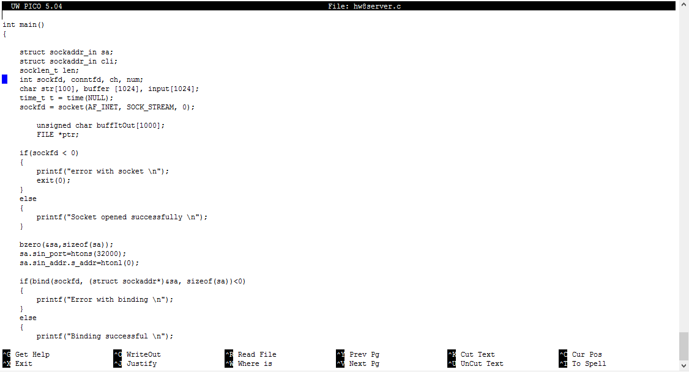

For my ICS 451 class we were tasked with creating a working server and client. Both the server and client were coded using C and have been testd on the UH Unix servers. Since there were no group assignmentseach student finished this project individually. There were different stages to the server/client build. Our first task was to create a server/client in C and open a port on the UH Unix servers to host our own created server. Once our server was up we would then take our client and establish a working connection. The second stage involved simulating the TCP handshake and sending a file to our client from the server. This project helped me understand how networks work by putting my coding skills to the test, creating something that I had no previous knowledge of.

  

