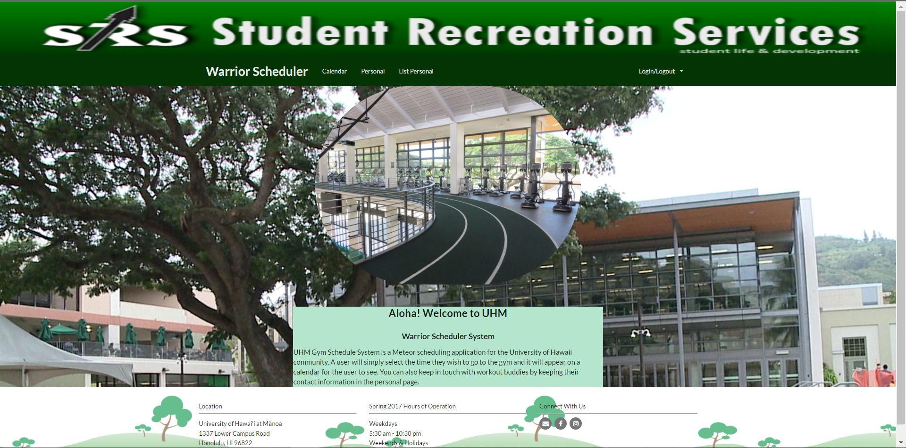
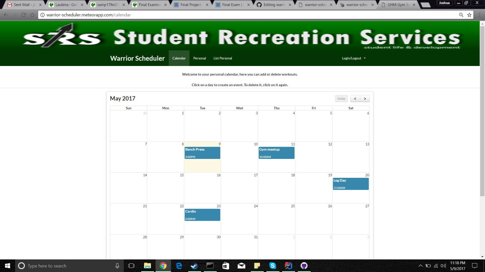
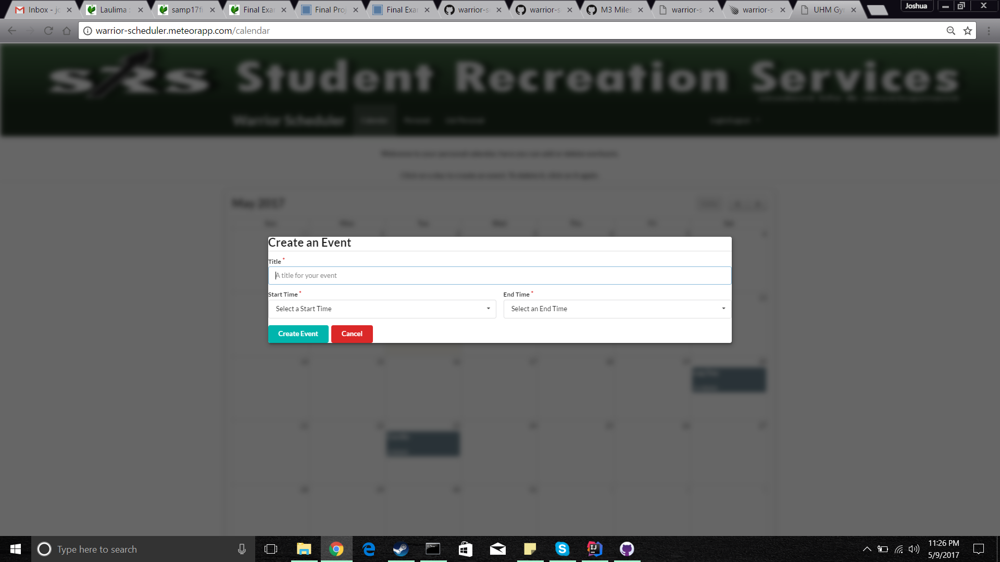
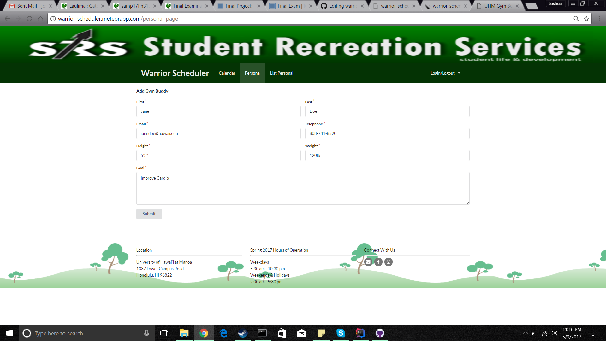
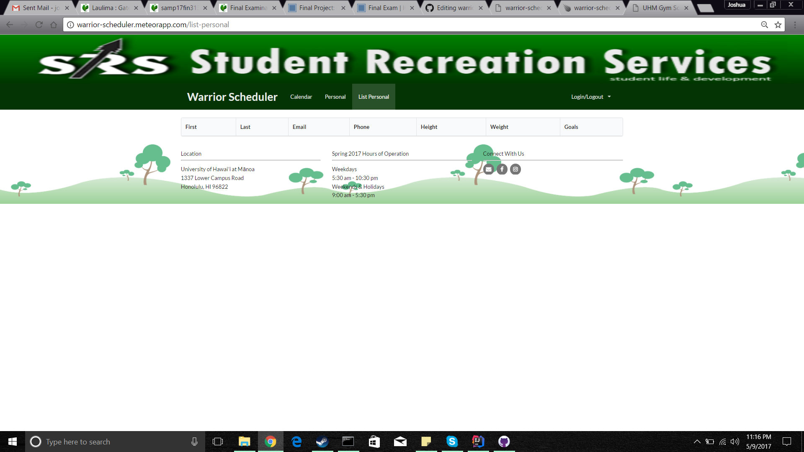

The GituHub page for this project can be found here [Skylite Manoa warrior-scheduler app](https://github.com/skylite-manoa/warrior-scheduler)

Developed in a team for ICS314 at UH Manoa, this project greatly helped me improve my skills of working in a team. Development of this app took place over a span of five weeks with three members in total. This app was designed for use with the Warrior Rec Center at UH Manoa. The app is restricted to UH community members with a hawaii.edu account. It keeps track of workouts that the user inputs into a Calendar. In addition to the Calendar, a personal page allows the user to input contact information so he/she may stay in touch with workout buddies, or anyone they meet at the gym. 

Through this project I learned how to deploy apps on Galaxy using meteor. I also strengthened my understanding of editing and committing files through GitHub and the Git Shell. I also learned how to connect the app to a MongoDB server which was the backbone of our app. My main contribution to the app was getting the personal page running and storing information in the database.

  

  

  

  

  

