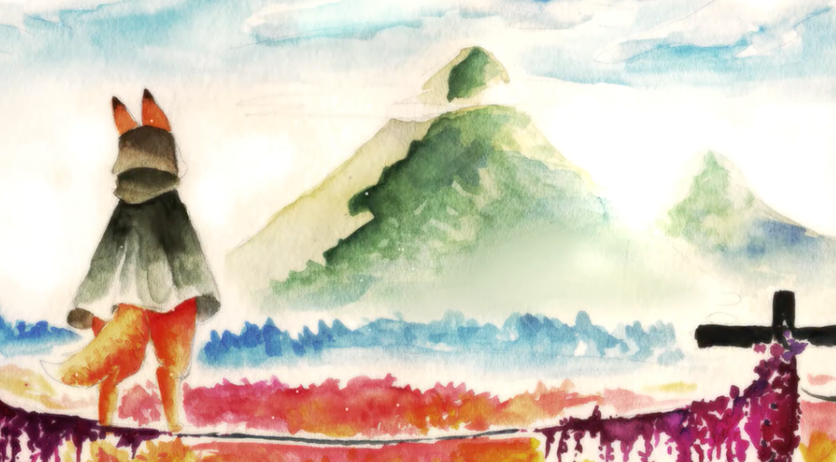
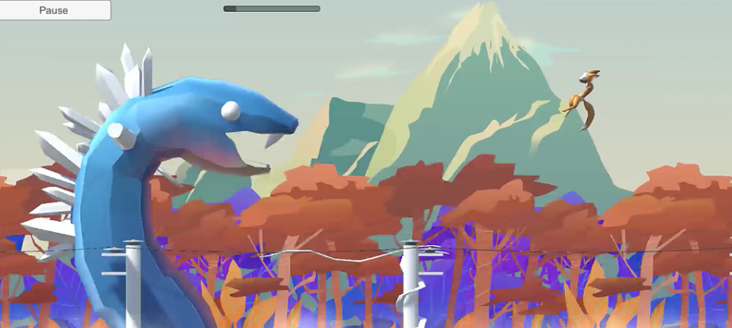
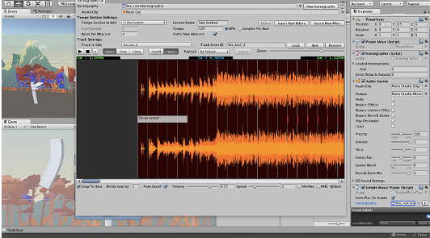
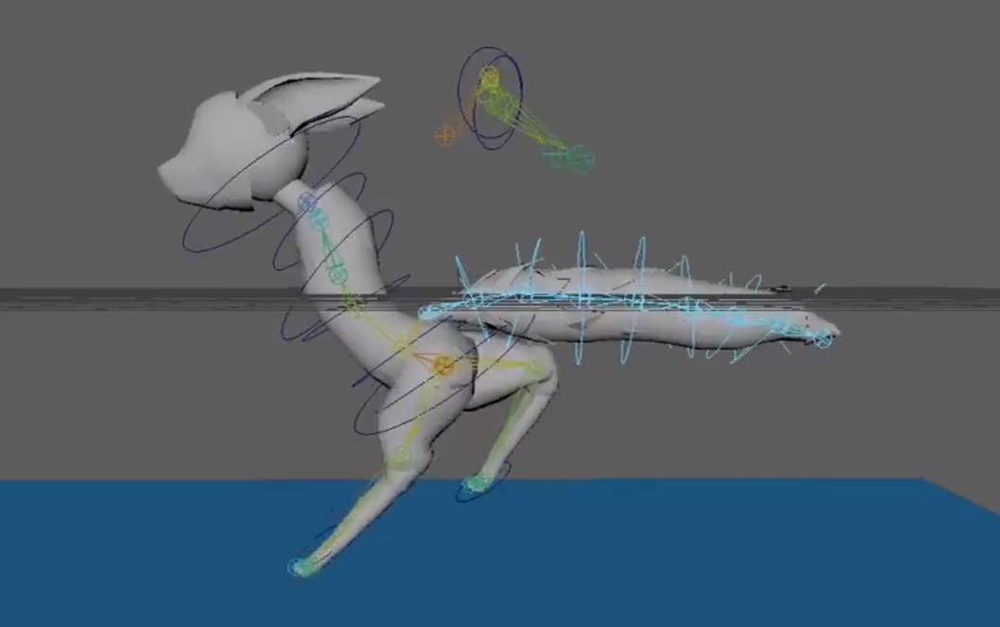

The group page and game demo can be found here, [AI37 Studios - Rhythmic Pulse](https://ai37studios.wixsite.com/ai37)

Developed in a team of six people for ICS485 at UH Manoa. The team was comprised of three developers (ICS majors), and three designers (ACM majors). Development for this game is most likely one the hardest tasks I encountered as a student at UH Manoa. As team lead for the ICS portion of the group, I learned skills important to management, punctuality, and team work. This game was developed over the span of 3 months; durning those three months there was non-stop planning and developing. Much of the development process was trial and error, many nights were spent in the library to ensure that progress was made in accordance to deadlines that needed to be met. I consider this project to be one of my fondest acheivements while at UH Manoa. 

  

  

  

  

